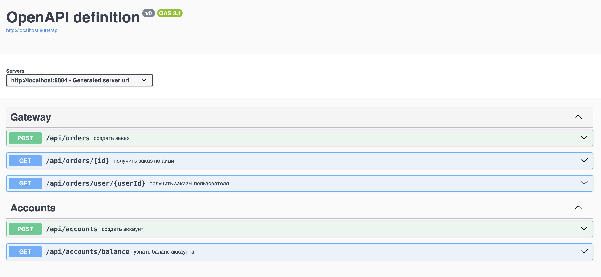
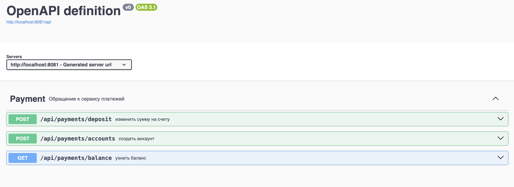
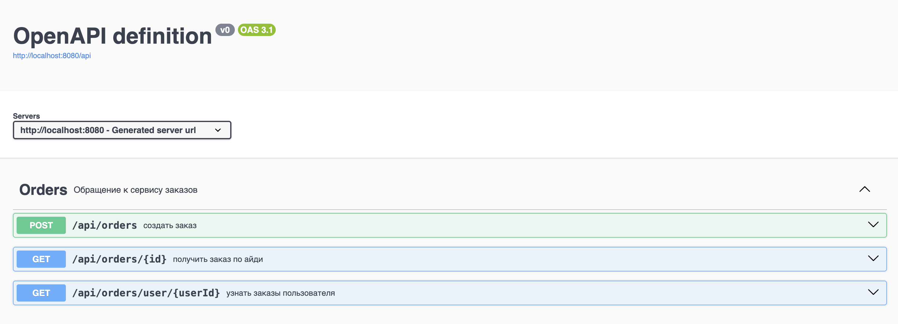
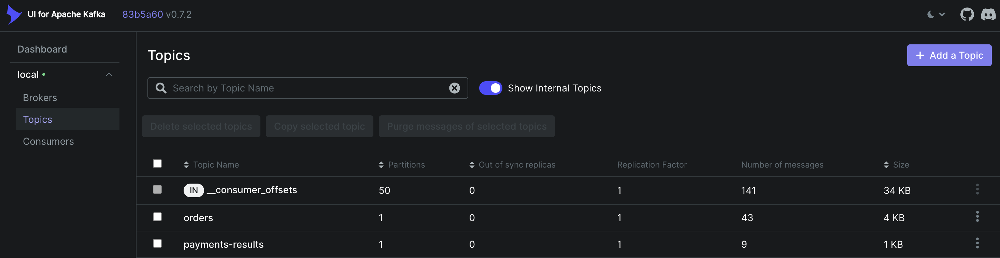

# Запуск

Для запуска всех сервисов необходимо из директории src выполнить
```
    docker-compose -f docker-compose.yml build
    docker-compose -f docker-compose-kafka.yml up
    docker-compose -f docker-compose.yml up
```
# Структура и API

Приложение состоит из трех микросервисов: Gateway, Order, Payment. Предполагается, что пользователь взаимодействует с сервисом Gateway,
который перенаправляет запросы остальным сервисам. 

Можно создать пользователя по айди (указав в поле amount первоначальный баланс пользователя), посмотреть его баланс, создать заказ, получить заказ по айди и получить все заказы пользователя.
Gateway отправляет синхронные rest-запросы сервисам Order и Payment.

При обработке заказа сервис Order отправляет асинхронный запрос через Kafka сервису Payment, который так же через Kafka отправляет результаты обработки 
заказа. При асинхронном взаимодействии сервисов использовались паттерны отказоустойчивости Transactional Inbox и Transactional Outbox.

Чтобы протестировать функционал каждого сервиса, можно подключиться к единому Swagger-у с выбором сервиса. Он запускается на порте 8083
(http://localhost:8083/)

Kafka-UI можно открыть по адресу http://localhost:8082/

Скрины:






